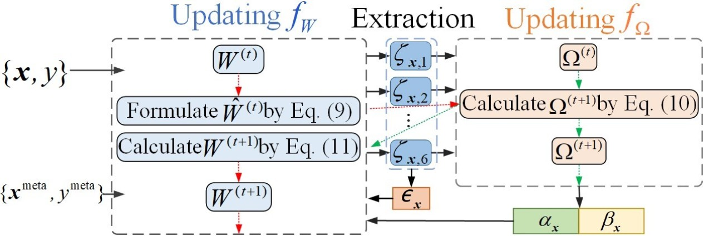
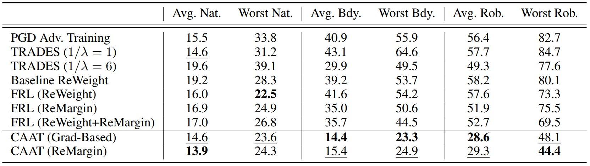
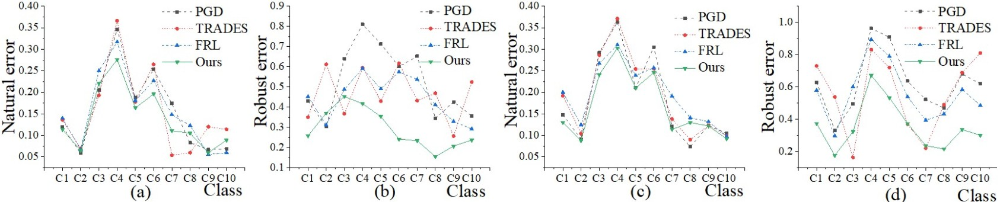

# CAAT
 
This is the code for the paper: Combining Adversaries with Anti-adversaries in Training (AAAI 2023)<br>

Citation
--------
If you find this study useful for your research, please cite our paper.
```
@article{Zhou_Yang_Wu_2023,
    title={Combining Adversaries with Anti-adversaries in Training},
    volume={37},
    url={https://ojs.aaai.org/index.php/AAAI/article/view/26352},
    DOI={10.1609/aaai.v37i9.26352},
    number={9},
    journal={Proceedings of the AAAI Conference on Artificial Intelligence},
    author={Zhou, Xiaoling and Yang, Nan and Wu, Ou},
    year={2023},
    month={Jun.},
    pages={11435-11442}
}
```
Abstract
--------
Adversarial training is an effective learning technique to improve the robustness of deep neural networks. In this study, the influence of adversarial training on deep learning models in terms of fairness, robustness, and generalization is theoretically investigated under more general perturbation scope that different samples can have different perturbation directions (the adversarial and anti-adversarial directions) and varied perturbation bounds. Our theoretical explorations suggest that the combination of adversaries and anti-adversaries (samples with anti-adversarial perturbations) in training can be more effective in achieving better fairness between classes and a better tradeoff between robustness and generalization in some typical learning scenarios (e.g., noisy label learning and imbalance learning) compared with standard adversarial training. On the basis of our theoretical findings, a more general learning objective that combines adversaries and anti-adversaries with varied bounds on each training sample is presented. Meta learning is utilized to optimize the combination weights. Experiments on benchmark datasets under different learning scenarios verify our theoretical findings and the effectiveness of the proposed methodology.



Setups
-------  
The requiring environment is as bellow:<br>
* Linux<br>
* python 3.8<br>
* pytorch 1.9.0<br>
* torchvision 0.10.0<br>

Running CAAT on benchmark datasets (CIFAR-10).
-------  
Here are two examples for training imbalanced and noisy data:<br>
ResNet32 on CIFAR10-LT with imbalanced factor of 10:<br>

`python CAAT.py --dataset cifar10 --imbalanced_factor 10`

ResNet32 on noisy CIFAR10 with 20\% pair-flip noise:<br>

`python CAAT.py --dataset cifar10 --corruption_type flip2 --corruption_ratio 0.2`

Experimental results
--------------------



For more results, please refer to our paper. 
